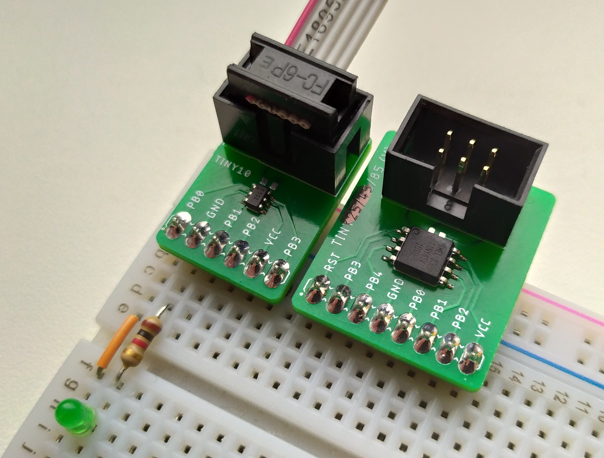

# AVR Breadboard Adapters
Breakout boards for the ATtiny4/5/9/10 and the ATtiny25/45/85V (and others)

## Compatible devices
### SOT23-6
* ATTINY4-TSxR
* ATTINY5-TSxR
* ATTINY9-TSxR
* ATTINY10-TSxR

### SOIC-8 (200mil wide)
* ATtiny11
* ATtiny12

* ATTiny13(V)-[10/20]SU(R)
* ATtiny13A-S[U/H/M/R](R)

ATtiny13A-SU
ATtiny13A-SUR
ATtiny13A-SH
ATtiny13A-SHR
ATtiny13A-SN
ATtiny13A-SNR
ATtiny13A-SF
ATtiny13A-SFR

ATtiny13V-10SU
ATtiny13V-10SUR
ATtiny13-20SU
ATtiny13-20SUR

ATtiny11L-2SC
ATtiny11L-2SI
ATtiny11L-2SU
 ATtiny11-6SC
 ATtiny11-6SI
 ATtiny11-6SU

ATtiny12V-1SC
ATtiny12V-1SI
ATtiny12V-1SU
ATtiny12L-4SC
ATtiny12L-4SI
ATtiny12L-4SU
 ATtiny12-8SC
 ATtiny12-8SI
 ATtiny12-8SU
 
 
 84?